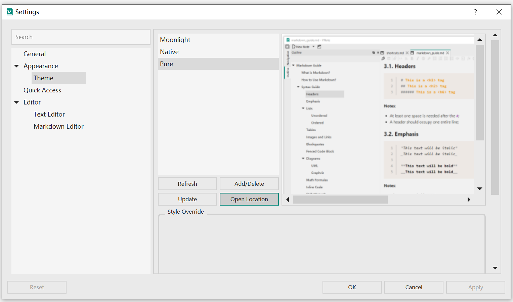

# Themes and Styles
## Themes
A **theme** specifies the look of VNote, the style of the editor and read mode, and the syntax highlight style of code block.

A theme corresponds to a folder in the `themes` folder. You could change and manage themes in the `Settings` dialog.



### How to Add A Theme
It is a good practice to start a custom theme based on an existing theme. Copy the folder of your favorite theme and paste it into the `themes` folder under **user configuration** folder. Remember to rename the folder.

### Components of A Theme
Some key files of a theme:

- `palette.json`: the palette of a theme which defines several colors to be used in the theme;
- `interface.qss`: file for [**Qt Style Sheet**](http://doc.qt.io/qt-5/stylesheet-reference.html), which specifies the look of all the widgets; it will use the colors defined by `palette.json`;
- `text-editor.theme`: theme file of the text editor (as well as Markdown editor);
- `web.css`: style sheet file of the read mode of Markdown;
- `highlight.css`: style sheet file of the read mode of Markdown for code block syntax highlight; VNote uses [Prism](https://prismjs.com/) for syntax highlight in read mode;

## Samples
### Customize Editor Fonts
#### Read Mode
For the font in **read mode**, it is specified in `web.css` by the `font-family` and `font-size`.

Styles of the body:

```css
body {
    margin: 0 auto;
    font-family: -apple-system, "Noto Sans", "Helvetica Neue", "Segoe UI", Helvetica, sans-serif, Tahoma, Arial, Geneva, Georgia, Palatino, "Times New Roman", "冬青黑体", "YaHei Consolas Hybrid", "Microsoft YaHei", "微软雅黑", "Microsoft YaHei UI", "WenQuanYi Micro Hei", "文泉驿雅黑", Dengxian, "等线体", STXihei, "华文细黑", "Liberation Sans", "Droid Sans", NSimSun, "新宋体", SimSun, "宋体", "Apple Color Emoji", "Segoe UI Emoji";
    color: #222222;
    line-height: 1.5;
    padding: 16px;
    background-color: #f5f5f5;
    font-size: 16px;
}
```

Styles of the code blocks and inline code:

```css
code {
    font-family: "YaHei Consolas Hybrid", Consolas, Monaco, Monospace, Courier;
    color: #8e24aa;
    word-break: break-word;
}

pre code {
    display: block;
    padding-left: 0.5em;
    padding-right: 0.5em;
    color: #222222;
    background-color: #e0e0e0;
    line-height: 1.5;
    font-family: "YaHei Consolas Hybrid", Consolas, Monaco, Monospace, Courier;
    white-space: pre;
    -moz-tab-size: 4;
    -o-tab-size: 4;
    tab-size: 4;
}
```

For code blocks with syntax highlight, styles are defined in `highlight.css`:

```css
code[class*="language-"],
pre[class*="language-"] {
    color: black;
    background: none;
    font-family: Consolas, Monaco, 'Andale Mono', 'Ubuntu Mono', monospace;
    font-size: 1em;
    text-align: left;
    white-space: pre;
    word-spacing: normal;
    word-break: normal;
    word-wrap: normal;
    line-height: 1.5;

    -moz-tab-size: 4;
    -o-tab-size: 4;
    tab-size: 4;

    -webkit-hyphens: none;
    -moz-hyphens: none;
    -ms-hyphens: none;
    hyphens: none;
}
```

#### Text Editor and Markdown Editor
For the font of text editor and Markdown editor, it is specified in `text-editor.theme` file.

Text editor:

```json
{
    "editor-styles" : {
        "Text" : {
            "//comment" : "Support a list of fonts separated by ,",
            "font-family" : "YaHei Consolas Hybrid, Consolas, Monaco, Andale Mono, Monospace, Courier New",
            "font-size" : 12,
            "text-color" : "#222222",
            "background-color" : "#f5f5f5",
            "selected-text-color" : "#f5f5f5",
            "selected-background-color" : "#1976d2"
        }
    }
}
```

Markdown editor:

```json
{
    "markdown-editor-styles" : {
        "Text" : {
            "//comment" : "Support a list of fonts separated by ,",
            "font-family" : "冬青黑体, YaHei Consolas Hybrid, Microsoft YaHei, 微软雅黑, Microsoft YaHei UI, WenQuanYi Micro Hei, 文泉驿雅黑, Dengxian, 等线体, STXihei, 华文细黑, Liberation Sans, Droid Sans, NSimSun, 新宋体, SimSun, 宋体, Verdana, Helvetica, sans-serif, Tahoma, Arial, Geneva, Georgia, Times New Roman",
            "font-size" : 12,
            "text-color" : "#222222",
            "background-color" : "#f5f5f5",
            "selected-text-color" : "#f5f5f5",
            "selected-background-color" : "#1976d2"
        }
    }
}
```

### Customize Interface Fonts
We need to edit `interface.qss` to customize the fonts of interface, such as the menu and the navigation tree.

[Qt docs](https://doc.qt.io/qt-5/stylesheet-examples.html) provides many detailed examples about the Qt stylesheet.

Change the font size of all the widgets:

```css
QWidget {
    font-size: 12pt;
}
```

Change the font size of all the tree view and list view:

```css
QTreeView, QListView {
    font-size: 12pt;
}
```

Change the font size of the notebook node explorer:

```css
vnotex--NotebookNodeExplorer QTreeView {
    font-size: 14pt;
}
```