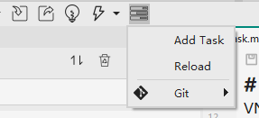
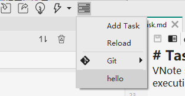

# 任务
VNote支持一个类似于[VSCode Tasks](https://code.visualstudio.com/docs/editor/tasks)的简单任务系统，可以方便地执行第三方程序。

## 加载任务
VNote会尝试从下面三个位置加载任务：

* `默认配置文件夹/tasks`包含内置的任务
* `用户配置文件夹/tasks`包含用户定义的任务
* `笔记本配置文件夹/tasks`包含该笔记本定义的任务

一个任务由一个`*.json`的入口文件给出定义。

## 一个简单的任务
点击任务菜单中的`添加任务`，打开用户定义的任务文件夹。



新建一个文件夹`hello`并在其下面新建一个文件`hello.json`。编辑该文件如下：

```json
{
    "command": "echo 'Hello Tasks'"
}
```

重新加载任务，我们可以看到菜单里面列出了一个新的任务`hello`。点击运行该任务。




### 自定义菜单项
```json
{
    "label": "Hello",
    "icon": "tasks-solid.svg",
    "shortcut": "Alt+H, T",
    "command": "echo",
    "args": [
        "Hello tasks!"
    ]
}
```

其中的图标文件`tasks-solid.svg`需要保存在JSON入口文件同目录。

### 子任务
任务可以无限嵌套。子任务会继承父任务的大部分属性。

```json
{
    "label": "Hello Tasks",
    "icon": "tasks-solid.svg",
    "shortcut": "Alt+H, T",
    "command": "echo",
    "args": ["Hello tasks!"],
    "tasks": [
        {
            "label": "Hello Cat",
            "icon": "cat-solid.svg",
            "shortcut": "Alt+H, C",
            "args": ["Hello cat!"]
        },
        {
            "label": "Hello Dove",
            "icon": "dove-solid.svg",
            "shortcut": "Alt+H, D",
            "args": ["Hello dove!"]
        },
        {
            "label": "Hello Fish",
            "icon": "fish-solid.svg",
            "shortcut": "Alt+H, F",
            "args": ["Hello fish!"]
        }
    ]
}
```

### 命令类型
任务的`type`属性定义了该任务的命令是如何被执行的。

* `shell`: 默认，将命令作为一个shell命令执行
* `process`: 将命令作为一个独立的程序执行

```json
{
    "type": "process",
    "label": "Open File with",
    "args": ["${file}"],
    "tasks": [
        {
            "label": "Typora",
            "icon": "Typora.svg",
            "command": "C:\\Programs\\Typora0.9.98\\x64\\Typora.exe"
        },
        {
            "label": "VS Code",
            "icon": "vscode.svg",
            "command": "C:\\Users\\tootal\\AppData\\Local\\Programs\\Microsoft VS Code\\Code.exe"
        }
    ]
}
```

::: alert-info

是的，`tootal`就是那个发起VNote任务系统的贡献者！

:::

VNote没有提供一个终端。我们可能需要使用`start`或者`gnome-terminal`或者`konsole`来在终端里面运行某些程序。

```json
{
    "label": "Vim",
    "icon": "vim.svg",
    "type": "process",
    "command": "gnome-terminal",
    "args": [
        "--execute",
        "vim",
        "${file}"
    ]
}
```

### 本地化和平台依赖选项
可以通过一个**区域字符串**JSON对象来提供本地化。

```json
{
    "label": {
        "en_US": "Hello",
        "zh_CN": "你好"
    }
}
```

可以使用`windows`/`linux`/`osx`关键词来指明不同平台的选项。

```json
{
    "type": "process",
    "label": "Open File with",
    "args": ["${file}"],
    "tasks": [
        {
            "label": "Typora",
            "icon": "Typora.svg",
            "windows": {
                "command": "C:\\Programs\\Typora0.9.98\\x64\\Typora.exe"
            },
            "linux": {
                "command": "/usr/bin/typora"
            }
        },
        {
            "label": "VS Code",
            "icon": "vscode.svg",
            "windows": {
                "command": "C:\\Users\\tootal\\AppData\\Local\\Programs\\Microsoft VS Code\\Code.exe"
            },
            "linux": {
                "command": "/usr/bin/code"
            }
        }
    ]
}
```

## 任务选项
一个任务可以有多个选项，其中有一些是必须的。

我们使用`[m]`来标记必须选项，`[l]`来标记支持本地化的选项。

* `version`: 任务文件的版本
* `label[l]`: 任务的名字
* `type`: 任务的类型，`shell`（默认）或者`process`
* `command[l]`: 需要执行的命令
* `args[l]`: 传递给命令的参数
* `options`: 运行任务的选项
    * `cwd`: 运行任务时的当前工作目录；如果不指定，会顺序尝试当前笔记本根文件夹，然后当前缓冲区所在文件夹，然后是当前任务文件所在文件夹
    * `env`: 运行任务的环境变量
    * `shell`: `shell`类型的任务的选项
        * `executable`: shell可执行文件；Windows上默认为`Powershell.exe`，Linux/macOS上默认为`/bin/bash`
        * `args`: 启动shell的参数
* `tasks`: 定义子任务
* `inputs`: 定义输入变量
    * `id[m]`: 输入变量的ID
    * `type`: `promptString`（默认，会提示用户输入），`pickString`（提示用户选择）
    * `description[l]`: 输入变量的描述
    * `default[l]`: 默认值
    * `password`: `promptString`类型下，是否启用密码模式
    * `options[l]`: `pickString`类型下提供的选项
* `windows`: 指定Windows系统的选项
* `linux`: 指定Linux系统的选项
* `osx`: 指定macOS系统的选项

## 变量
一个任务可以通过形式`${variableName}`来使用VNote提供的变量。变量可以在任务运行时提供有用的信息。

变量可以在选项`command`/`args`/`options.cwd`/`options.env`中使用。

### 内建变量
笔记本相关变量：

* `notebookFolder`: 笔记本根文件夹路径
* `notebookFolderName`
* `notebookName`
* `notebookDescription`

缓冲区相关变量：

* `buffer`: 当前缓冲区路径
* `bufferNotebookFolder`: 当前缓冲区所属笔记本的根文件夹路径
* `bufferRelativePath`
* `bufferName`
* `bufferBaseName`
* `bufferDir`: 当前缓冲区所在目录
* `bufferExt`: 当前缓冲区的扩展名后缀
* `selectedText`: 当前缓冲区查看窗口的所选文本

任务相关变量：

* `cwd`: 当前工作目录
* `taskFile`: 任务入口文件路径
* `taskDir`: 任务入口文件所在目录
* `exeFile`: VNote可执行文件路径
* `pathSeparator`: 平台相关的路径分隔符
* `notebookTaskFolder`: 当前笔记本任务文件夹路径
* `userTaskFolder`: 用户任务文件夹路径
* `appTaskFolder`: 默认任务文件夹路径
* `userThemeFolder`: 用户主题文件夹路径
* `appThemeFolder`: 默认主题文件夹路径
* `userDocsFolder`: 用户文档文件夹路径
* `appDocsFolder`: 默认文档文件夹路径

其他特殊变量：

* 通过`${magic:snippet_name}`引用VNote的**片段**
* 通过`${env:env_name}`访问环境变量
* 通过`${config:[main|session].json_object_path}`访问VNote的配置选项
    * `main`对应读取自`vnotex.json`的主要配置，`session`对应读取自`session.json`的会话配置
    * 使用`arr[index]`来访问一个JSON数组
    * 例如`${config:main.core.shortcuts.FullScreen}`可以读取`FullScreen`对应的快捷键

#### 输入变量
一个任务可以通过`${input:input_id}`使用**输入变量**来提示用户提供输入

目前有两种类型的输入变量：

* `promptString`
* `pickString`

```json
{
    "command": "echo",
    "args": ["${input:what}"],
    "inputs": [
        {
            "id": "what",
            "type": "promptString",
            "description": "Type something, it will show in output panel."
        }
    ]
}
```

#### Shell变量
一个任务可以通过`${shell:shell_command}`使用**shell变量**来执行一个shell命令并获取其输出。

*   `${shell:git rev-parse --abbrev-ref HEAD}` → `master`
*   `${shell:whoami}` → `tootal`
*   `${shell:dig github.com -4 +short}` → `52.69.186.44`

## 示例
在默认配置任务文件夹中有一个内建的`Git`任务。

编译并运行：

```json
{
    "command": "g++ \"${file}\" -o \"${fileBasenameNoExtension}\"; if ($?) { start cmd \"/c `\"${fileBasenameNoExtension}`\" & pause\" }"
}
```

运行一个HTTP服务：

```json
{
    "command": "start cmd.exe \"/c python -m http.server\" ; start http://localhost:8000"
}
```
