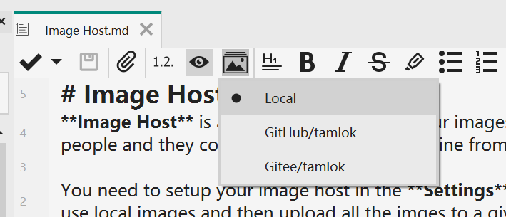

# 图床
**图床**是一个用于保存图片的在线服务。和本地图片不一样，如果使用图床，用户可以只需要分享纯文本的 Markdown 文件即可，无需额外的图片文件，人们就可以在任意地方访问到其中的图片。

首先需要在**设置**里面设置图床。然后，就可以在编辑器里面选择使用本地图片还是图床。如果网络比较差，可以在编辑的时候先选择本地图片，然后最后上传所有图片到指定图床。

## 配置
### GitHub/码云
码云和 GitHub 有相似的流程。这里我们以 GitHub 为例。

1. 前往 GitHub 的 `Settings`，`Developer settings`，然后生成一个新的 `Personal access tokens`。
    
2. 为令牌选择 `repo` 范围，然后生成该令牌。复制。
    
3. 新建一个用于保存图片的**公开**仓库。记住选择生成默认的 `README` 文件，这样会创建第一个提交。
4. 在 VNote 里面新建一个图床，输入**个人令牌**，**用户名**和**仓库名**。