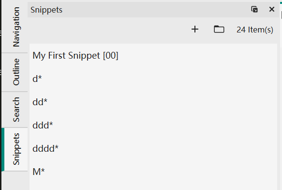
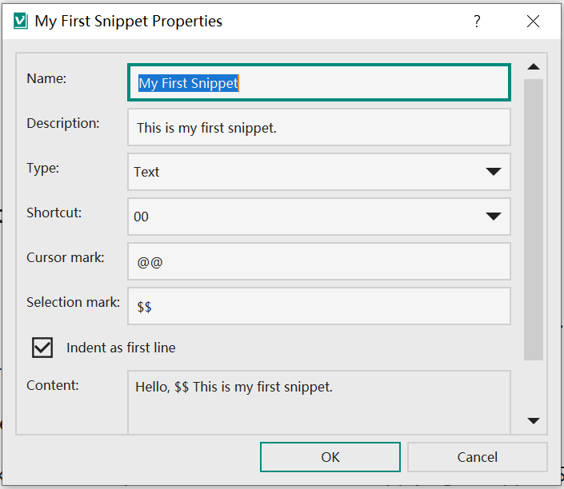
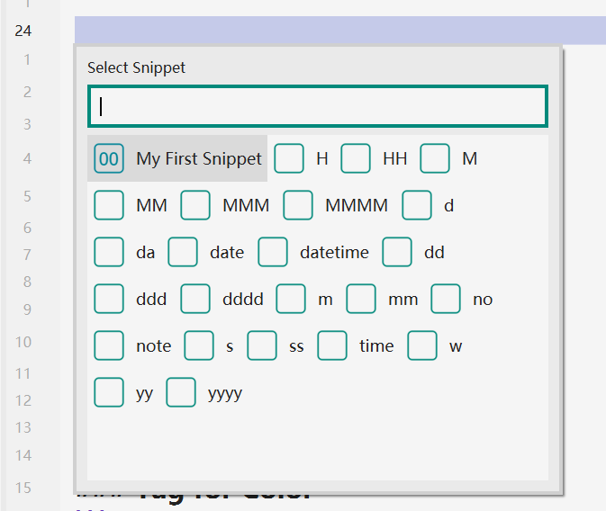

# 片段
片段旨在方便重复输入一些内容。

## 片段管理
每个用户自定义的片段都会对应一个 `json` 文件。VNote 自带内建的片段，例如输入当前日期的片段。内建片段是只读的，并且在名字后面会带有一个 `*` 后缀。



## 定义一个片段


- 片段名称： 一个片段的标识符，用于搜索一个片段。
- 快捷键：可以为片段指定一个两位数的快捷键以便快速输入。
- 光标标记：插入片段后，VNote 使用光标标记表示光标的位置。应该只在内容中出现一次。
- 选择标记：VNote 使用选择标记来标记插入应用片段前所选文本的位置。选择标记可以在内容中出现多次。插入片段后，所有选择标记都将替换为所选文本。

## 应用片段
### 片段面板
将编辑器光标放在合适的位置，然后双击片段面板中的片段以应用一个片段。

### 快捷键
编辑器中，按 `Ctrl+G, I` 可以唤出一个包含所有片段的面板。如下图，此时可以直接输入 `00` 来应用片段 `My First Snippet`。或者输入关键字 `my` 来按名字搜索片段，然后按回车来应用第一个片段。

可以按 `Tab` 来将焦点转移到片段列表中，此时可以使用 `Ctrl+H/J/K/L` 来遍历这些项目并按回车应用当前片段。



### 符号
另一个应用片段的简单方法是在编辑器中直接输入 `%片段名字%` 然后按 `Ctrl+G, I` 来将该符号翻译到对应的片段 `片段名字`。

此外，VNote 中很多行编辑框是支持通过符号来应用片段的，例如：

* 新建笔记对话框；
* 新建笔记本对话框；
* 笔记模板；

## 例子
### 插入C++代码块
    ```cpp
    @@
    ```

### 注释掉所选文本
```
<!-- $$@@ -->
```

### 颜色标记
```
<font color=red>$$@@</font>
```

或：

```
<mark>$$@@</mark>
```
